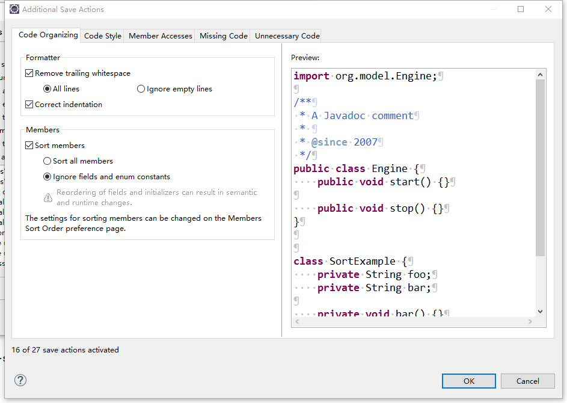
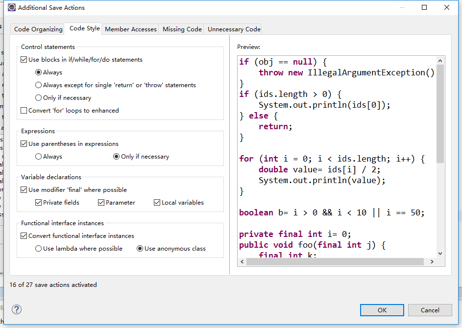
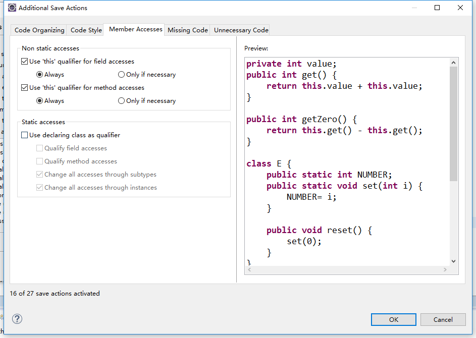
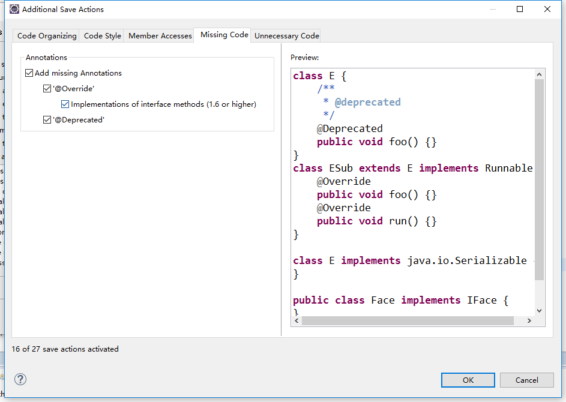
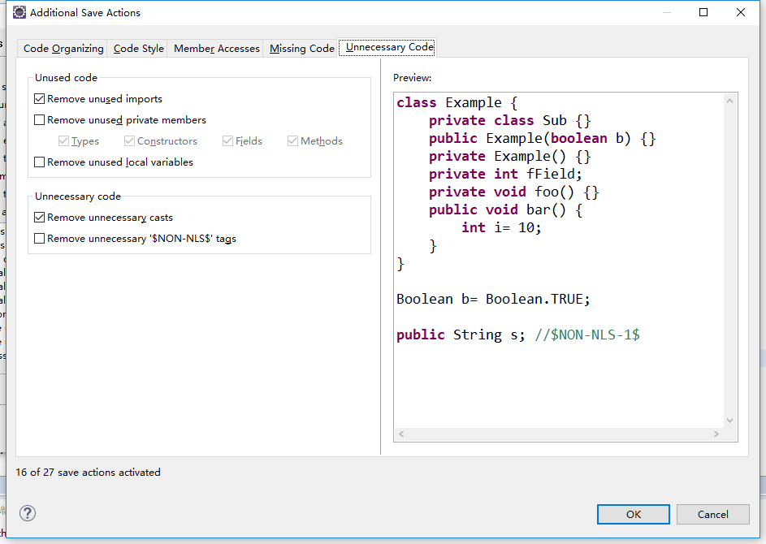

# 一、 修改 Eclipse 用户名 ：${user}

#### 1. 打开 eclipse.ini ，在 -vmargs 下添加 -Duser.name=你的名字
#### 2. 重启 eclipse
    
# 二、 设置 Eclipse 注释 ： 

### 路径 ： Window -> Preference -> Java -> Code Style -> Code Template -> Comments
     
#### 1.文件(Files)注释标签：
    /**   
     * @Title: ${file_name} 
     * @Package ${package_name} 
     * @Description: ${todo}(用一句话描述该文件做什么) 
     * @author ${user}   
     * @date ${date} ${time}   
     */
 
#### 2.类型(Types)注释标签（类的注释）：
    /** 
     * @ClassName: ${type_name} 
     * @Description: ${todo}(这里用一句话描述这个类的作用) 
     * @author ${user}
     * @date ${date} ${time} 
     * 
     * ${tags} 
     */
 
#### 3.字段(Fields)注释标签：
    /** 
     * @Fields ${field} : ${todo}(用一句话描述这个变量表示什么) 
     */
 
#### 4.构造函数标签：
    /** 
     * 
Title: 
 
     * 
Description: 
 
     * ${tags} 
     */
 
#### 5.方法(Constructor & Methods)标签：
    /**
     * @Title: ${enclosing_method} 
     * @Description : ${todo} (这里用一句话描述这个方法的作用)
     * ${tags} 设定文件 
     * @return ${return_type} 返回类型
     *
     * @author : ${user}
     * @mail : xxxx@xx.com
     * @Date : ${date}
     */
 
#### 6.覆盖方法(Overriding Methods)标签：
    /* (非 Javadoc) 
     * 
Title: ${enclosing_method}
 
     * 
Description: 
 
     * ${tags} 
     * ${see_to_overridden} 
     */
 
#### 7.代表方法(Delegate Methods)标签：
    /**
     * ${tags}
     * ${see_to_target}
     */
 
#### 8.getter方法标签：
    /** 
     * @return ${bare_field_name} 
     */
 
#### 9.setter方法标签：
    /** 
     * @param ${param} 要设置的 ${bare_field_name} 
     */
     
# 三、 设置 Eclipse 编码风格为 Google ： 

### 路径 ： window -> preferences -> Java -> Code Style -> Formatter -> Import

#### 1. 选择 resource/configuration/eclipse-java-google-style.xml 文件

#### 2. 点击 edit 修改 Indentation size 为 4

#### 3. 设置自动格式化代码为 Google 风格

* 路径 ： Window -> Preferences -> Java -> Editor -> Save Actions
* 勾选 "Perform the selected actions on save" 及下面三个复选框 "Format source code -> Format all lines"、"Organize imports"、"Additional actions"
* 点击 Configure 按以下方式进行设置：

